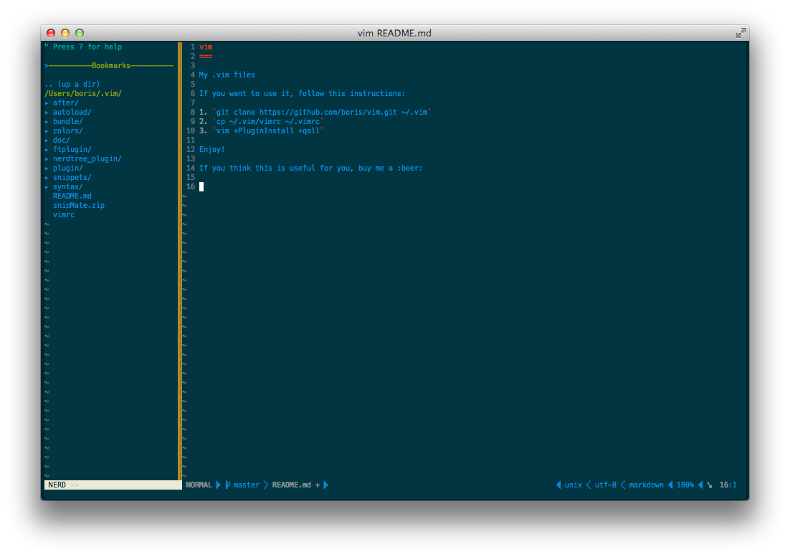

vim
===

My .vim files 

If you want to use it, follow this instructions:

1. `git clone https://github.com/boris/vim.git ~/.vim`
2. `cp ~/.vim/vimrc ~/.vimrc`
3. `vim +PluginInstall +qall`

Enjoy!

If you think this is useful for you, buy me a :beer:

